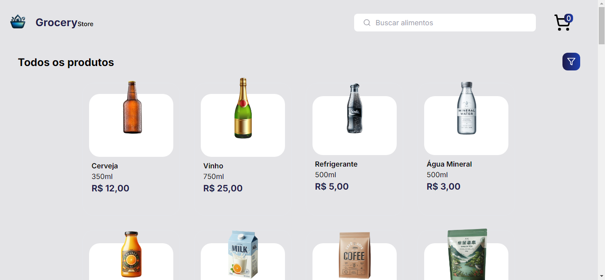
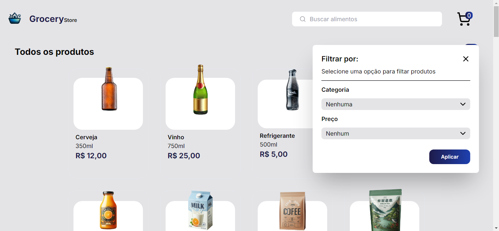
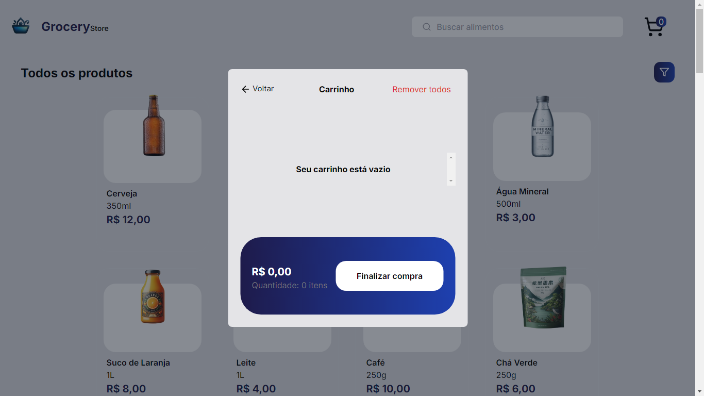
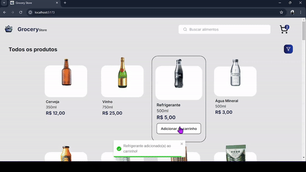

<p align="center">
  
</p>

## <p align="center">Grocery Store</p>

<p align="center">
   
   
</p>

Grocery Store é um ecommerce online com o objetivo de trazer praticidade para o cliente, podendo ele comprar seus alimentos diretamente de seu dispositivo.


## 📸 Screenshots
<p align="center">
  
  
  
</p>

## 🎥 Preview

<p align="center">
  
</p>

## 🚀 Rodando localmente

Clone o projeto

```bash
  git clone https://github.com/ismael-henrique-dev/Grocery-Store.git
```

Entre no diretório do projeto

```bash
  cd Grocery-Store
```

Instale as dependências

```bash
  npm install
```

Inicie o servidor

```bash
  npm run dev
```


## 💻 Tecnologias Utilizadas
- 
- 
-   
- 
- 

## 🛠️ Funcionalidades

- Pesquisa por nome do produto
- Filtragem por categoria ou preço do produto
- Adicionar/remover produtos específicos
- Remover todos os produtos
- Alterar quantidade de produtos


## 🎓 Aprendizado

O objetivo desse projeto foi aprender, com ele consegui aperfeiçoar meus conhecimentos em React, TypeScript e Tailwindcss. O foco também foi desenvolver a lógica de programação, tive bastante dificuldade em implementar funcionalidades relacionadas as alterações do checkbox e do carrinho, mas após bastante pesquisa consegui resolver esse problema.


